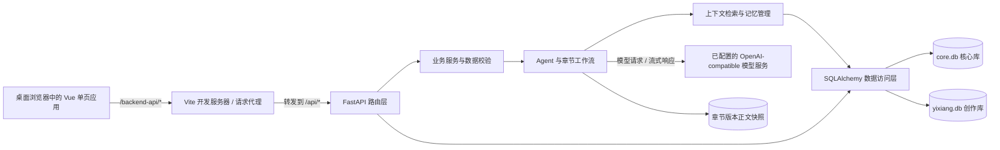

# 臆想创作

臆想创作是面向长篇小说创作的本地优先工作台，用来整理项目资料、规划章节、创作和修改正文，并追踪人物、组织、伏笔等设定随剧情的变化。

当前版本以本地 Web 应用方式运行：前端在桌面浏览器中使用，后端和数据保存在本机。仓库尚未包含 Electron、Tauri 等原生桌面封装，也没有独立安装包。

## 功能总览

| 工作区 | 主要用途 |
| --- | --- |
| 创作中心 | 进入项目创作功能，查看项目概况 |
| 项目配置 | 管理小说项目基本信息、题材和写作默认项 |
| 世界观设定 | 管理背景、规则、地点等世界资料 |
| 大纲管理 | 组织卷、章节和剧情规划；卷章可调整顺序 |
| 人物卡片 | 管理人物身份、性格、经历、动机、成长和自定义属性 |
| 人物关系 | 建立人物间的关系，并记录关系类型和变化 |
| 组织势力 | 管理组织资料、层级、资源、成员、盟友和敌对关系 |
| 伏笔看板 | 按生命周期管理线索，追踪埋设、发展、回收及废弃状态 |
| 章节生成 | 按大纲上下文生成、编辑、分析和管理章节正文 |
| 长期记忆 | 查看章节摘要和已沉淀的项目设定记忆 |
| 设定共创 | 通过 Agent 对话梳理人物、世界观等结构化设定 |
| 系统管理 | 配置模型 API、用户、菜单、字典和系统配置 |

### 章节生成工作台

- **按大纲顺序创作**：生成新章时以已保存的大纲顺序确定目标；已有章节可继续编辑、改稿和分析，不会被当作新章覆盖。
- **多种生成流程**：快速写作侧重直接生成；智能模式先规划再写作；深度创作包含规划、写作、精修和分析等步骤。
- **本章参数**：设置章节目标、节奏、写作风格、创意程度、重点技能和参考资料。手动勾选的上下文与系统补充的资料会显示在本次上下文预览中。
- **草稿与中断恢复**：正文草稿自动保存；生成流程支持暂停、续跑或中断时保留可恢复内容，避免迟到响应覆盖后续编辑。
- **对话改稿**：会话按章节保存，可针对整章或选中的连续片段提出修改。候选稿先供作者查看，明确应用后才写回正文。
- **分析与审阅**：分析结果关联被分析的正文版本；人物、组织、世界观和伏笔等变化作为提案展示，经作者审阅后再写回。
- **版本、偏好和轨迹**：历史版本可查看、比较、收藏和恢复；恢复会创建新版本并保留旧历史。项目写作偏好、个人编辑器字号和工作流运行记录分别管理。

### 长期记忆与设定共创

长期记忆支持查看和检索章节摘要及项目记忆；设定共创 Agent 会结合选中的资料进行多轮对话、补充提问并整理设定。章节分析产生的人物、组织、世界观和伏笔变化会先作为提案供作者审核。

## 技术架构



### 分层职责

1. **前端页面与组件**：Vue 3、TypeScript、Vue Router、Pinia 和 Naive UI 构成单页应用。`src/pages/` 编排页面流程，`src/components/` 放置可复用组件，章节生成工作台拆分在 `src/components/chapter-generation/`。
2. **前端 API 客户端**：`src/api/` 封装 HTTP 与流式请求。开发时请求先发送到 Vite 的 `/backend-api` 代理，再转发到 FastAPI 的 `/api` 路由。
3. **后端 API 与领域逻辑**：FastAPI 接收业务请求；`app/api/` 按项目、资料、Agent 和系统管理组织路由，`app/services/` 放置业务规则与数据处理。
4. **Agent 与工作流**：`app/agents/`、`app/agents_v3/` 和 `app/skills/` 管理 Agent、Skill、提示词及章节工作流。模型访问由后端统一执行，生成正文和改稿支持流式返回。
5. **记忆与上下文**：`app/memory/` 按项目和章节检索人物、世界观、伏笔、摘要及长期记忆，为章节生成和对话改稿组装上下文。
6. **持久化**：SQLAlchemy 模型和版本化迁移管理数据库结构。SQLite 默认拆分为全局核心库和项目创作库；章节版本正文另有文件快照，数据库记录版本号、来源和当前版本关系。

### 章节创作的主要数据流程

```text
配置项目与世界观
        ↓
建立卷章大纲，并按剧情需要调整顺序
        ↓
维护人物、关系、组织与伏笔等项目资料
        ↓
选择下一篇章，确认生成模式、目标和上下文
        ↓
后端检索资料 → Agent 工作流调用模型 → 流式返回正文
        ↓
自动保存草稿与版本，作者可对话改稿或精修
        ↓
分析正文 → 审阅资料变化提案 → 确认后沉淀记忆
```

章节生成、上下文预览和分析使用明确的章节身份与正文快照。正文修改后，旧分析会被识别为过期；设定提案不会在未审核时静默覆盖项目资料。

## 技术栈

```text
前端：Vue 3、TypeScript、Vite、Naive UI、Pinia、Vue Router
后端：Python、FastAPI、Pydantic、SQLAlchemy
默认数据库：SQLite（核心库与创作业务库分开）
模型接口：OpenAI-compatible API
```

## 环境要求

- Windows 10/11 或其他支持 Python 和 Node.js 的桌面系统
- Python 3.10 或更高版本，建议 Python 3.11
- Node.js 18 或更高版本及 npm
- 一个可调用的 OpenAI-compatible 模型服务及对应 API 地址、模型名称和密钥

## 启动方式

### Windows 开发启动

首次启动前，请在项目根目录打开两个 PowerShell 终端。

#### 终端一：后端

```powershell
cd backend
python -m venv .venv
.\.venv\Scripts\python.exe -m pip install --upgrade pip
.\.venv\Scripts\python.exe -m pip install -r requirements.txt
.\.venv\Scripts\python.exe -m uvicorn app.main:app --reload --host 127.0.0.1 --port 8001
```

后端启动时会自动运行核心库和业务库迁移。保持该终端运行。

#### 终端二：前端

```powershell
cd frontend
npm install
npm run dev
```

保持该终端运行，然后访问 <http://127.0.0.1:5173>。首次使用进入“API 配置”，填写模型服务地址、模型名称和 API Key。

日常再次启动时，在后端终端进入 `backend/`，运行 `.\.venv\Scripts\python.exe -m uvicorn app.main:app --reload --host 127.0.0.1 --port 8001`；在前端终端进入 `frontend/`，运行 `npm run dev`。用虚拟环境中的 Python 启动 Uvicorn，可避免误用系统 Python。依赖不需要重复安装。

### 桌面端使用

当前桌面端指在 Windows 桌面浏览器中运行本地 Web 应用，不是独立 `.exe` 程序。先按上面的方式启动后端和前端，再使用浏览器打开 `http://127.0.0.1:5173`。

如果已安装 Microsoft Edge，可在服务启动后通过 PowerShell 以应用窗口形式打开页面：

```powershell
Start-Process msedge '--app=http://127.0.0.1:5173'
```

此窗口仍依赖前后端服务运行；关闭窗口不会自动停止服务。停止服务时回到两个终端分别按 `Ctrl+C`。如需免终端运行的安装包，需要后续增加桌面壳和打包流程；当前仓库没有该功能。

### 本地构建预览

需要查看前端生产构建效果时，在 `frontend/` 运行：

```powershell
npm run build
npm run preview
```

这会在本地预览构建后的前端页面（默认 `http://127.0.0.1:4173`）。后端仍需单独启动。此预览用于本地检查，不代表已配置生产部署。

## 数据、配置与备份

默认数据库和版本文件位于 `backend/data/`：

| 路径 | 保存内容 |
| --- | --- |
| `backend/data/core.db` | 全局用户、菜单、字典、系统配置等核心数据 |
| `backend/data/yixiang.db` | 项目、世界观、大纲、章节、人物、组织、伏笔、记忆和工作流等创作数据 |
| `backend/data/versions/` | 章节正文的历史版本快照 |

备份或迁移时，先停止后端，再复制整个 `backend/data/` 目录。目录中包含小说正文和项目资料，也可能包含模型配置，请妥善保管，不要提交到公开代码仓库。数据库结构由后端迁移管理；启动新版本前建议先备份数据目录。

## 开发检查

前端类型检查与生产构建：

```powershell
cd frontend
npm run build
```

后端回归测试（先激活 `backend/.venv`）：

```powershell
cd backend
python -m unittest discover -s tests
```

本地接口文档：<http://127.0.0.1:8001/docs>

健康检查：<http://127.0.0.1:8001/api/health>

## 代码目录

```text
backend/
  app/api/                 FastAPI 路由与接口
  app/agents/              Agent 基础能力
  app/agents_v3/           章节工作流、Agent 预设和版本持久化
  app/core/                配置、模型客户端等公共能力
  app/db/migrations/       核心库与业务库迁移
  app/memory/              记忆存取与上下文检索
  app/models/              SQLAlchemy 数据模型
  app/services/            项目业务服务
  data/                    本地数据库和章节正文快照
  tests/                   后端回归测试
frontend/
  src/api/                 前端 API 客户端
  src/components/          可复用 UI 组件
  src/components/chapter-generation/
                           章节工作台子面板
  src/pages/               页面与流程编排
  src/stores/              Pinia 状态
docs/                      设计说明与开发计划
prompts/                   Agent 提示词模板
```

## 相关说明

- [章节生成工作台优化开发计划](docs/章节生成工作台优化开发计划.md)
- [长期记忆与设定共创计划](docs/long-term-memory-setting-co-iteration-plan.md)
