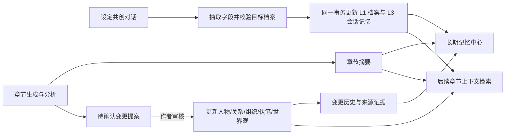

# 长期记忆与设定共创迭代计划

## 目标

让小说创作资料在章节创作前可检索、创作中可引用、章节完成后可审核地更新，并能追溯每条记忆来自哪次对话或哪一章。设定共创负责把作者的补充整理成结构化档案；章节分析负责提出剧情变化；长期记忆中心负责查看沉淀结果和来源。

## 当前结构与边界

- **L1 项目资料**：人物、人物关系、世界观、组织、伏笔等结构化档案，作为生成上下文的事实来源。
- **L2 会话记忆**：一次章节工作流或设定共创中的临时上下文，不应冒充已经持久化的项目事实。
- **L3 项目记忆**：`memory_items` 中带项目、类型、来源和重要性的条目；章节分析的候选变化则先写入变更提案，审核通过才更新档案。
- **L4 写作偏好**：项目级或用户级生成偏好，不与小说世界事实混存。
- **章节摘要**：单独按章节保存摘要、人物变化、世界变化、新伏笔和时间线事件，供前情回顾与记忆中心浏览。



## 迭代路线

### 第一阶段：让当前数据可见、可验证（本轮完成）

- 为伏笔看板提供覆盖六种生命周期状态的 24 条样例，关联当前项目人物与组织，并写入初始历史快照。
- 共创目录使用真实伏笔档案，不再显示不可点击的静态字段；共创会话必须绑定当前项目中的有效档案。
- 人物、世界观、伏笔字段与本会话 L3 记忆在同一事务中更新；同一会话持续合并一条记忆，避免每轮对话重复新增。
- 提供最近共创会话恢复入口；长期记忆中心显示项目记忆条目数、记忆类型筛选，并在章节摘要为空但已有长期条目时默认展示有内容的索引。

### 第二阶段：完善记忆中心的来源审阅

- **已完成基础检索与分页**：长期条目支持数据库侧关键词、类型筛选和 50 条分页；详情可见共创目标 ID、会话来源及记忆 ID。
- 待增加按来源、章节、角色/组织实体的组合筛选，补充章节提案、审核状态与章节范围的来源展示。
- 待在详情页展示来源章节、提案审核结果、目标实体名称及章节范围；允许作者修订或归档错误记忆。
- 把摘要与 L3 条目做明确区分：摘要是章节回顾，L3 是可被后续生成引用的事实或偏好。
- 对重复、互相矛盾、被后续章节推翻的记忆给出提示；保留原记录和修订来源，不做静默覆盖。

### 第三阶段：接通章节变化到持久资料

- 分析器始终接收最终保存版本的正文，并输出可校验的结构化变化。
- 将人物状态、关系、组织、伏笔、世界观和时间线变化都形成提案；每项都带实体 ID、变化前值、建议值、章节证据和理由。
- 审核通过时，在一个事务里更新实体、写变更历史、更新摘要/记忆，并把提案标记为已应用；重复审核保持幂等。
- 目标不存在、前值已变化、章节顺序非法时标成冲突并要求重新确认，不覆盖作者后来手动修改的内容。

### 第四阶段：让记忆检索服务连续创作

- 先做结构化过滤：项目、章节有效期、角色/组织关联、伏笔状态和来源可信度。
- 再做关键词召回和摘要排序；只有积累到足够语料后再引入向量召回。
- 在生成页提供“本章实际引用了哪些设定/记忆”的上下文预览，发现过期或冲突内容时允许排除并记录原因。
- 记忆条目保留章节时间边界，避免后续剧情的真相提前泄露到较早章节。

### 第五阶段：质量与运行保障

- 为提案应用、伏笔迁移、共创写回、记忆去重和跨章节检索建立自动化回归用例。
- 记录 LLM 原始结构化响应、校验失败原因和人工修订结果，建立小规模离线样本评估抽取准确率。
- 对导入、备份、删除项目和历史迁移补充数据一致性检查。

## 本轮实现内容

- 设定共创空白页提供人物、世界观和伏笔入口；输入区可插入按目标类型生成的提问模板，并能将当前会话导出为本地 Markdown。
- 进入设定共创时恢复当前项目最近会话；切换项目会清空旧项目视图，异步响应按项目与会话校验，避免过期数据覆盖新页面。
- 对 Agent 消息采用标签与样式类白名单后再渲染，导出时转换为可读纯文本，避免把消息中的任意 HTML 当作界面内容执行。
- 设定共创消息可展开查看本轮处理摘要，并保存模型供应商返回的输入、输出与总 Token 数；供应商未提供时标明不可用，不用估值填充。
- 设定共创回复与字段提取合并为单次模型请求，并参考最近 12 条对话及当前档案；针对用户本轮意图回复，不再用固定问题列表重复盘问。
- 用户请求生成补充建议时，先给出与目标档案相关的候选并等待用户选择；候选未确认前不写入人物/世界观/伏笔档案，明确采纳后再提取并同步。
- 共创处理摘要使用中文字段标签和实际写回状态，不展示内部字段 key；明确纠正时支持替换字段，普通补充仍保留已有内容。
- 伏笔样例导入脚本显式指定项目 ID，默认预览；只有添加 `--apply` 才写库，并可重复执行而不重复创建。
- 设定共创只对当前项目内存在的档案开放；记忆只有在档案及记忆都成功提交后才标记为已沉淀。
- 支持恢复历史会话，并从会话绑定的项目档案重新读取完整度与详情。
- 记忆中心在项目仅有长期条目、尚无章节摘要时默认展示长期记忆索引。
- 长期记忆中心支持读取 TXT/Markdown 小说文件，预览并修正识别出的章节号和标题，再按章保存正文。
- 章节分析按顺序执行并逐章落库；分析结果继续使用现有章节摘要和待审核变更机制，避免直接覆盖人物、关系、组织等正式档案。
- 已存在的章节正文默认保留；同章节号存在多条章节记录时阻止导入，避免误选写入目标。已有正文但尚无摘要的章节可以直接补记忆，空章节只补正文并保留原有大纲关联与状态。
- 新增章节分析状态查询和“补充已有章节记忆”入口。导入中断后，已保存正文不会丢失；重新选同一文件会跳过已有正文，或使用回填入口继续分析缺少摘要的章节。
- 模型未配置或不可用时，分析明确返回失败状态，不把开发占位文本保存为章节摘要；正文仍保留，可在模型恢复后重试。

### 本轮导入边界

- 当前支持浏览器本地选择 TXT、MD、Markdown 文件，单文件上限 20 MB；识别常见“第 X 章/回”和“Chapter X”标题。未识别标题时按单章预览，作者需在导入前核对。
- 批处理在当前页面顺序运行，没有独立的后台任务队列。页面关闭或刷新后，已保存章节和摘要仍然保留；可重新选文件继续未完成导入，或使用已有章节回填入口重试。
- 暂不替换已有正文，不做自动合并、重复内容判定或章节重排；后续可单独增加显式覆盖预览和关联摘要/提案的失效处理。

## 后续验收场景

1. 给人物补充外貌与动机，重复补充同一内容，档案不堆叠重复文本，会话记忆保持单条且来源可追溯。
2. 切换到另一项目并尝试打开原项目人物 ID，接口拒绝跨项目读取和写入。
3. 在伏笔看板创建或选择一条线索，通过共创补充关键词、描述和备注，保存后看板、详情卡与 L3 记忆一致。
4. 恢复旧会话继续补充设定，旧消息仍可见，记忆更新在原会话条目中。
5. 审核章节变更后更新相应档案和历史；重复提交同一审核不会重复应用，前值冲突时不会覆盖作者的新值。
6. 生成指定章节时，过期伏笔和未来章节才揭晓的信息不会进入当前上下文。
7. 长期记忆超过 50 条时可翻页；关键词与类型筛选作用于项目全量记忆，而不局限于当前页。

## 数据准备

伏笔样例脚本位于 `backend/scripts/seed_foreshadowing_demo.py`。从 `backend` 目录执行时先预览：

```powershell
.\.venv\Scripts\python.exe -m scripts.seed_foreshadowing_demo --project-id 1
```

确认目标项目后写入：

```powershell
.\.venv\Scripts\python.exe -m scripts.seed_foreshadowing_demo --project-id 1 --apply
```

所有样例关键词以“【看板测试】”开头。清理前可在伏笔看板按该标记筛选；脚本不包含自动删除逻辑，避免误删用户在样例上做的测试修改。
